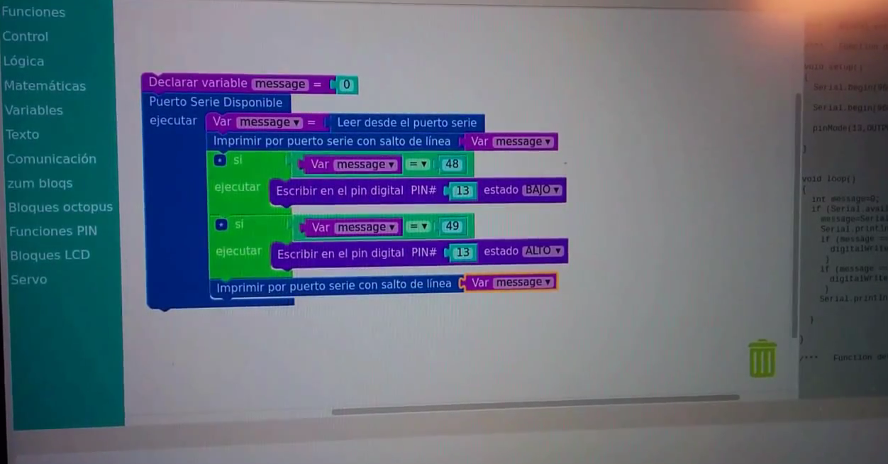
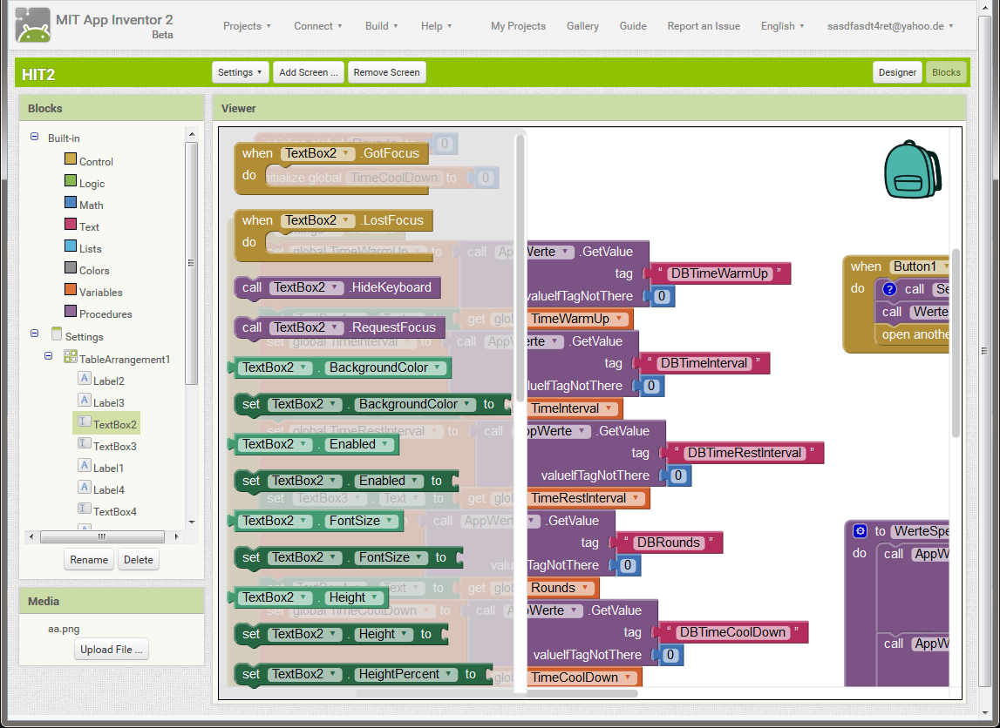
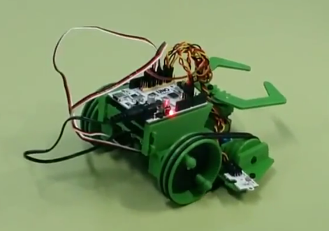

# Propuesta de actividades de formación en diferentes tecnologías

Destinatarios: alumnos de 14-16

Duración 12 meses (150 horas)

Horario: Dos sesiones de 1,5h a la semana

## Programación con Scratch  (24h - 8 semanas)

Introducción a la programación con Scratch.

  

## Introducción a la robótica con Arduino (30h 10 semanas)

* Programación de Arduino con bloques (Bitbloq)
* Proyectos  sencillos con Arduino

## Programación de videojuegos con Scratch (24h - 8 semanas)

Creación de juegos sencillos como

Hacer juegos como

* Space Invader

  

* Breakout

  

## Creación de aplicaciones para móviles Android con AppInventor I (24h - 8 semanas)

Creación de aplicaciones Android con bloques  (App Inventor)

## Creación y control de  robots con Arduino (30h 10 semanas)

Realización de proyectos robóticas basados en Arduino a partir de una serie de plantillas de proyectos ya realizados.

## Creación de aplicaciones para móviles Android con AppInventor II (24h - 8 semanas)

Creación de aplicaciones Android con bloques  (App Inventor)

