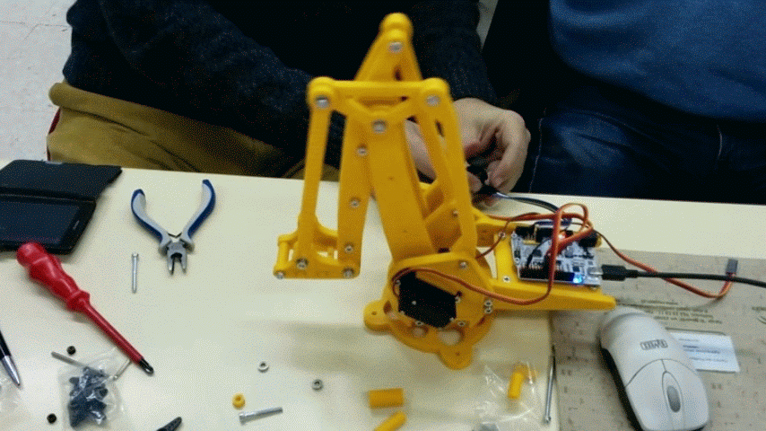
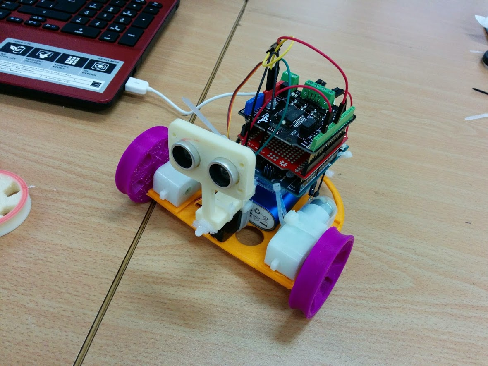

# Propuestas para la exposición de robótica del Parque de las Ciencias

Me encantan los robots de Lego, pero creo que esta exposición puede ser un lugar excelente para mostrar el enorme mundo de los robots open-source

De paso se les presenta a los docentes y al público en general que pueden construir sus propios robots

Cada uno de los modelos tendría a su lado un código QR que apunte a su diseño para descargarlo (quizás a una página del Parque de las ciencias)

## Exposición

Se podrían incluir algunos robots opensource en la exposición para dar visibilidad al moviendo Maker actual

### Impresión y ensamblaje de un robot [Inmoov](https://inmoov.fr/)

A lo largo de la exposición se van imprimiendo piezas y se van ensamblando
(Por sencillez se puede obviar la parte electrónica e ir pegando las piezas impresas)

### Brazos robóticos

Existen muchos modelos disponibles y se podía pensar en emprimir algunos y

### Robots siguelíneas

### PlotClock

## Talleres

### Profesorado

  

* Construcción, montaje y programación de robots opensource

  Difusión de los modelos y de las posibilidades que proporciona el Open-source y la impresión 3D

  Se pueden dividir en 3-4 sesiones

* Creación y montaje de kit de robótica/electrónica

### Familias y Escolares

Usaremos robots fácilmente construibles y con kit que el profesora puedo construir

  

* Montaje y control de robots opensource (hasta 11 años en adelante)

* Montaje y programación de robots opensource (12 años en adelante)

* Construcción de robots con productos reciclados

  
