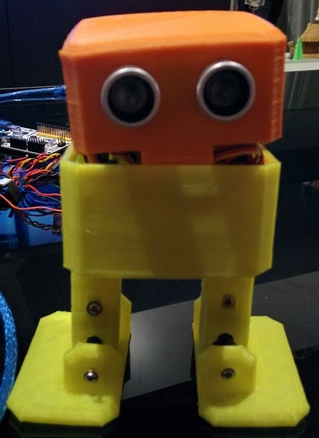
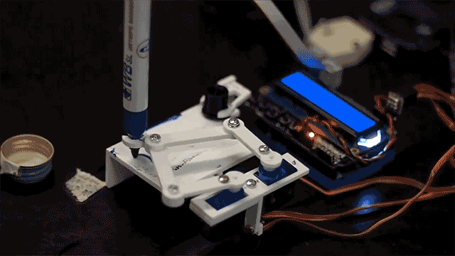
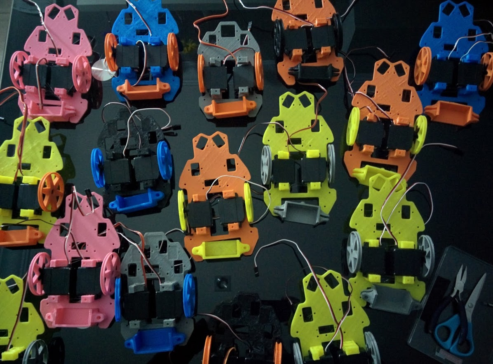
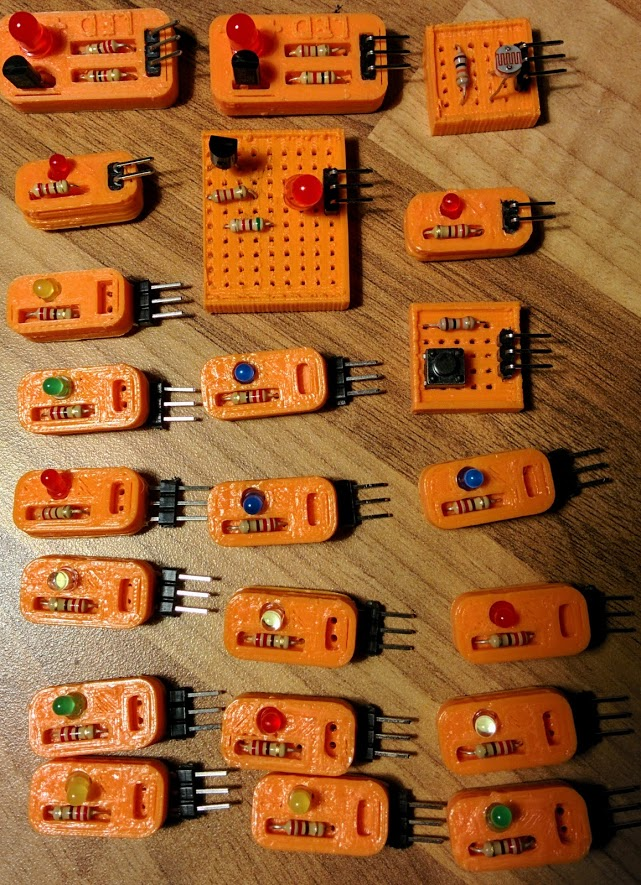
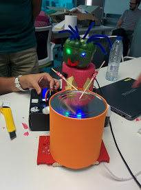

# Propuestas para la exposición de robótica del Parque de las Ciencias

Cada uno de los modelos tendría a su lado un código QR que apunte a su diseño para descargarlo (quizás a una página del Parque de las Ciencias)

Se podrían incluir algunos robots opensource en la exposición para dar visibilidad al moviendo Maker actual

### Impresión y ensamblaje de un robot [Inmoov](https://inmoov.fr/)

[Piezas, workroad]()

[Test de si se es capaz](https://inmoov.fr/finger-starter/)

[Building InMoov](https://ultimaker.com/en/community/20036-inmoov)

([Estimación del coste](http://www.robots-and-androids.com/Gael-Langevin-and-InMoov.html))

|Material|Costo|Tiempo|
|---|---|---|
|Piezas impresas(190)|150|2000h|
|Electrónica(3)|100||
|Cámaras|100||
|Raspbery 3|40||
|Motores(40)|400||
|Tornillería|50||
|Alimentación|40||
|Nylon|20||
|Montaje||90d|
|Total|1000€|¿? - 700h|

### PlotClock

|Material|Costo|Tiempo|
|---|---|---|
|Piezas impresas|5|2h|
|Electrónica|50||
|Motores|10||
|Tornillería|5||
|Montaje||4h|
|Alimentación|10||
|Total|80€|6h=150€|

### 4xiDraw

[Tutorial 1](http://www.instructables.com/id/4xiDraw/?ALLSTEPS) [Tutorial 2](http://robottini.altervista.org/cartesio-low-cost-cartesian-plotter-robot) [Video](https://www.youtube.com/watch?v=87jS-LegrHM)

|Material|Costo|Tiempo|
|---|---|---|
|Piezas impresas|10|4h|
|Electrónica|50||
|Motores|40||
|Varillas|10||
|Alimentación|15||
|Montaje||10h|
|Total|140€|16h=400€|

### Estación de medida de calidad del aire

Estación de medida de gases y párticulas en suspensión similar a la del [proyecto Leptos](https://imvec.tech/leptos/) pero con conectividad inalámbrica

|Material|Costo|Tiempo|
|---|---|---|
|Piezas impresas||2h|
|Electrónica|80||
|Alimentación|40||
|Montaje||10h|
|Total|140€|10h=250€|

## Talleres

### Profesorado/visitas de colegios (3h)

  

* Construcción, montaje y programación de robots opensource

  Difusión de los modelos y de las posibilidades que proporciona el Open-source y la impresión 3D y que puedan utilizar en sus aulas

  Se pueden dividir en 3-4 sesiones, Modelos e impresión, montaje y programación

* Creación y montaje de kit de robótica/electrónica

  

  La idea es que puedan crear su propio kit de electrónica que los propios alumnos pueden construir y utilizar

### Familias y Escolares (2h)

Usaremos robots fácilmente construibles y con un kit que el profesor puede construir

  

* Montaje y control de robots opensource (hasta 11 años)

  Montan y controlan con tablets o móviles los robots

* Montaje y programación de robots opensource (12 años en adelante)

  Montan y programan el robot que han construido

* Construcción de robots con productos reciclados

  Utilizando el kit de electrónica y componentes reciclados crean y construllen sus propios robots

  
